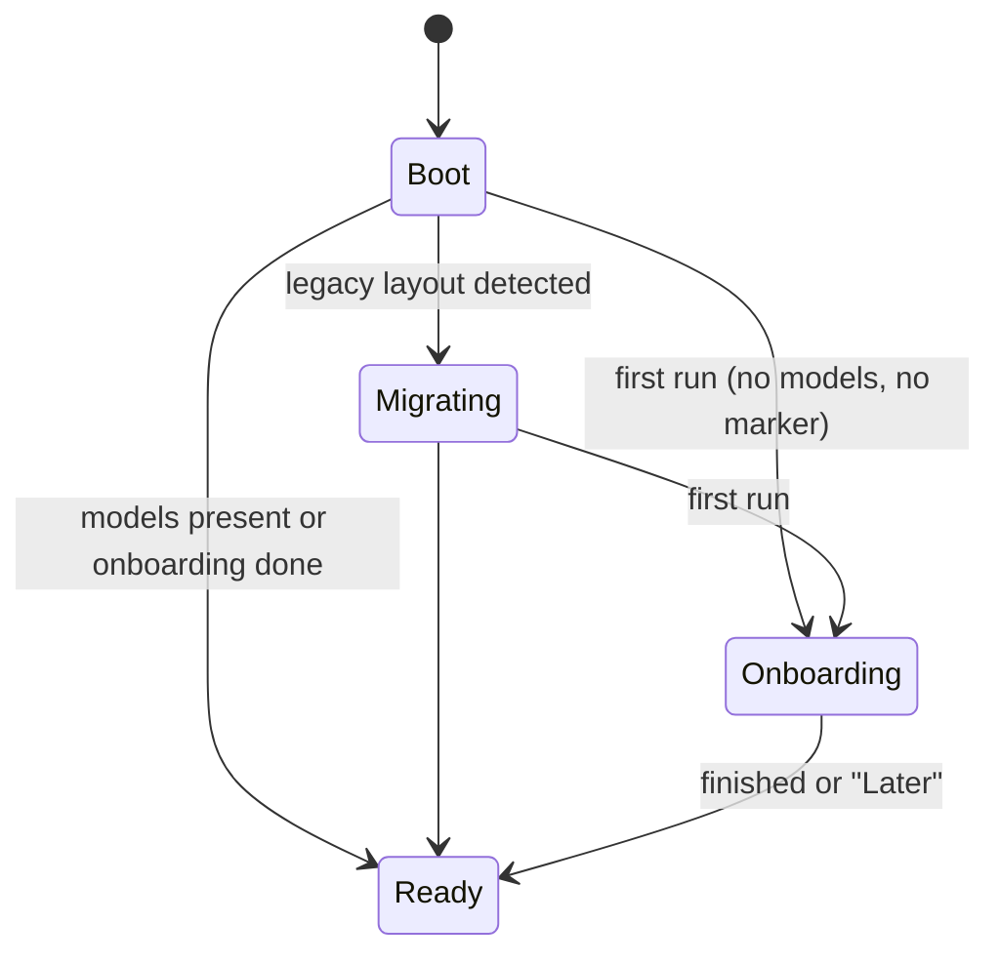
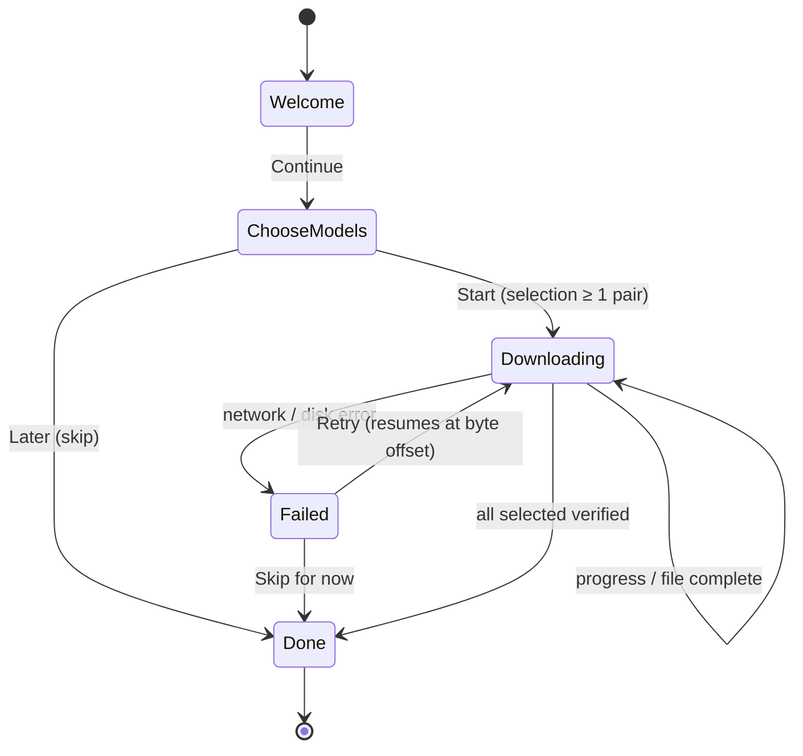
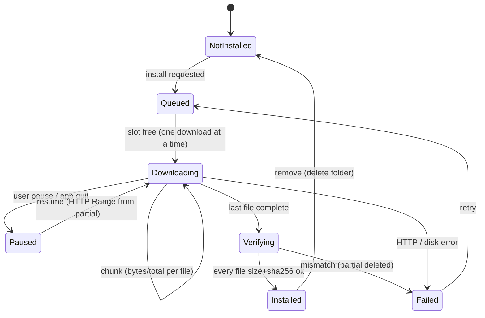
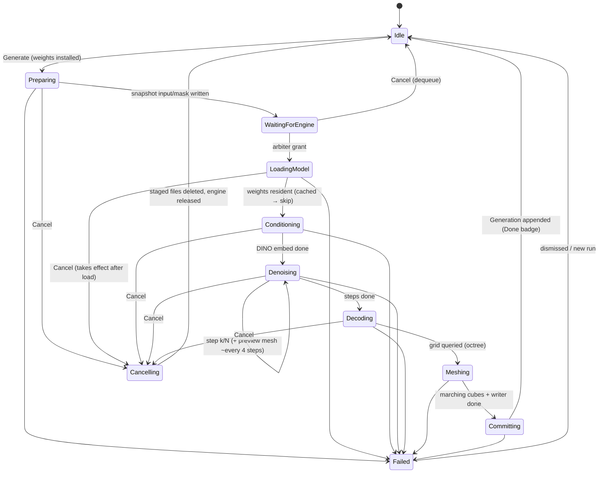
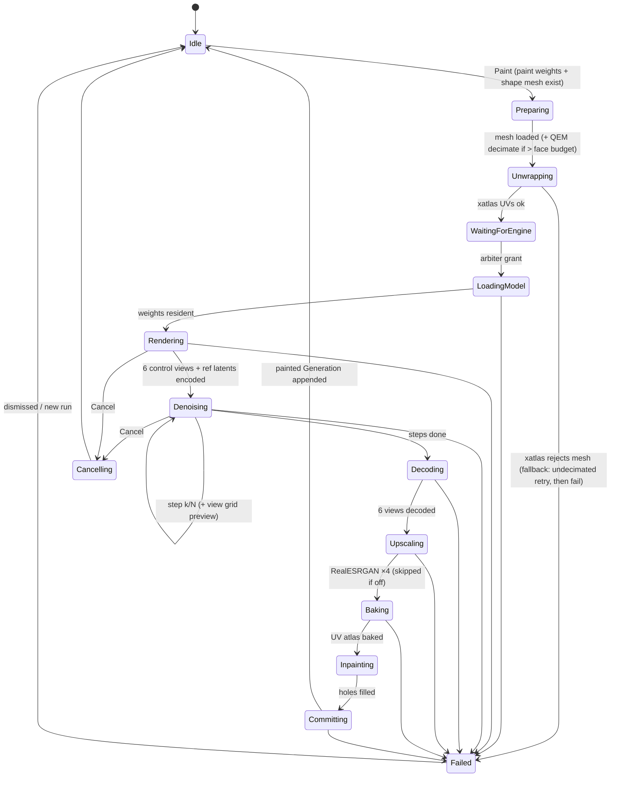
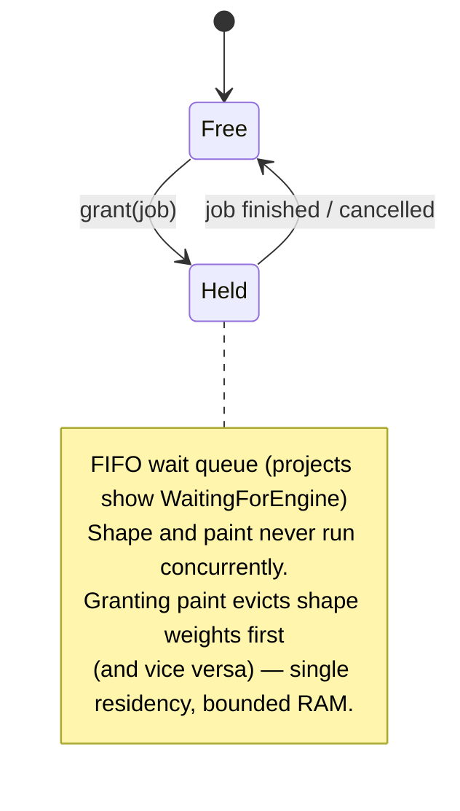
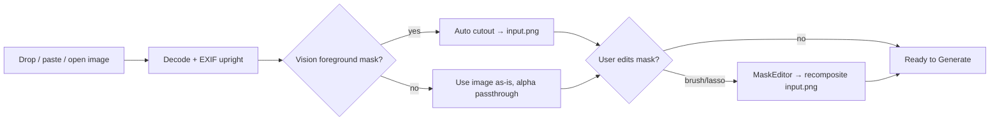
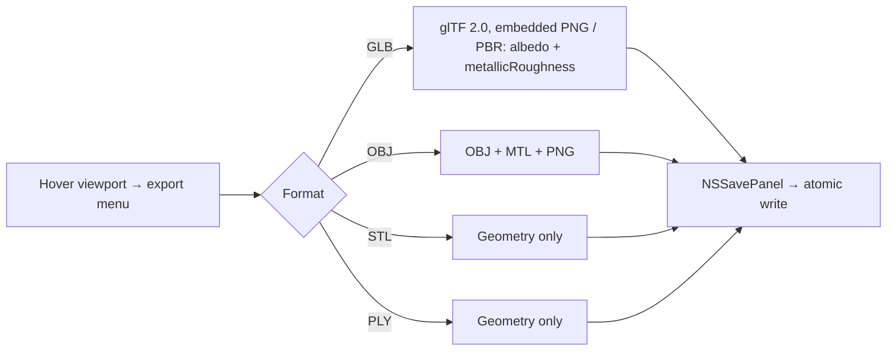

# Modelr — Design

Image → 3D on your Mac. Fully native, fully local: Hunyuan3D shape + paint pipelines running
in-process on MLX Swift. This document is the single source of truth for the app's product
surface, its deterministic state machines, every user flow, the model/weights contract, and
the verification plan.

Sibling deliverable: [`Hunyuan3D-Swift`](../Projects/Hunyuan3D-Swift) — the standalone
open-source Swift package (shape + paint libraries + `hy3d` CLI + parity tests vs the
known-good Python MLX ports).

---

## 1. Product definition

One window, project-based. A project = one input image → one current shape mesh (+ version
history) → optionally one painted/textured mesh (+ history). Everything visible at once:
image pane, shape pane, paint pane (paint optional). Toolbar has three islands: **history**,
**shape**, **paint** — shape and paint fully split.

Flows (each charted in §4):

1. **First-run onboarding** — welcome → choose models → download (resumable) → ready.
2. **Import** — drop/paste/open an image → automatic background removal → optional mask edit.
3. **Generate (shape)** — one click; live point-cloud/preview stream during denoise; mesh appears in shape pane.
4. **Paint (texture)** — one click on an existing shape; multiview render → denoise → bake; textured mesh in paint pane.
5. **Export** — hover buttons in the top-right of each viewport: GLB, OBJ+MTL, STL, PLY (PBR GLB carries albedo + metallic-roughness).
6. **Versions** — every completed generation is immutable; restore/delete from the history island.
7. **Model management** — Settings → Models: install/remove any of the four models, sizes, disk usage.

Non-goals for this milestone: App Sandbox (explicitly not required), StoreKit/Pro tiers,
iOS build, Hunyuan3D-2.1 *shape* (3.3B MoE), non-Hunyuan model families.

## 2. Model lineup (2×2) and weights contract

Two models per stage — one small, one large. Chosen from the parity-verified zoo:

| Slot | Checkpoint | Why | Runtime shape (M4 Max) |
|---|---|---|---|
| **Shape · Small** | `hunyuan3d-dit-v2-mini` (0.6B, 30-step CFG) | smallest RAM, correct + fast | ~5 s fp16, 0.8–4.1 GB by quant |
| **Shape · Large** | `hunyuan3d-dit-v2-0-turbo` (1.1B distilled, 8-step consistency, guidance-embed) | ≈ base-2.0 quality at turbo speed | ~17 s |
| **Paint · Small** | `hunyuan3d-paint-v2-0` (SD2.1 UNet, MA+RA, RGB) | color texture, 2048 atlas | ~32 s @384/15 |
| **Paint · Large** | `hunyuan3d-paintpbr-v2-1` (MA+RA+MDA+DINO+PoseRoPE) | PBR: albedo + metallic-roughness, 4096 atlas | ~63 s @384/15+SR |

Deliberately excluded: `2mini-turbo` (distills poorly — stripes thin features), shape `2.1`
(unsupported in Swift, softer detail), `mini-fast` (no weights published).

### 2.1 HuggingFace weight repos (owned, curated)

The app downloads from **our own HF repos** so the byte layout is a contract we control
(the official Tencent repos lack a stable layout guarantee and the app previously skipped
`config.yaml`, silently mis-configuring every non-mini model). Repos (public, under
`zimengxiong`, model cards carry Tencent Hunyuan3D community-license + DINOv2/RealESRGAN
attributions):

```
hunyuan3d-mlx-shape-small/   config.yaml, model.fp16.safetensors            (~3.8 GB)
hunyuan3d-mlx-shape-large/   config.yaml, model.fp16.safetensors            (~4.9 GB)
hunyuan3d-mlx-paint-small/   unet/{config.json,diffusion_pytorch_model.safetensors}
                             vae/{config.json,diffusion_pytorch_model.safetensors}
                             realesrgan/rrdbnet_mlx.safetensors             (~3.9 GB)
hunyuan3d-mlx-paint-large/   unet/{config.json,diffusion_pytorch_model.safetensors}
                             vae/{config.json,diffusion_pytorch_model.safetensors}   # v2-0 VAE (PBR reuses it)
                             dinov2/{config.json,model.safetensors}
                             realesrgan/rrdbnet_mlx.safetensors
                             scheduler/scheduler_config.json                (~8.7 GB)
```

Each repo is **self-contained** (VAE/RealESRGAN duplicated rather than cross-referenced);
disk is cheap, broken cross-repo links are not.

### 2.2 ModelCatalog (baked manifest)

A static `ModelCatalog.swift` — generated at upload time, checked in — lists for every model:
repo id, revision (pinned commit), files with **exact byte sizes and sha256**. Download
correctness = size + sha256 match; no runtime manifest fetch, no parsing surprises.

### 2.3 On-disk layout (Application Support/Modelr)

```
models/
  shape-small/  shape-large/  paint-small/  paint-large/    # exactly the repo layouts above
  *.partial                                                  # in-flight downloads (resumable)
projects.json                                                # index (atomic writes, backup-on-corrupt)
projects/<uuid>/  source.* input.png mask.png gen_<id>.mesh painted_<id>.tmesh …
```

Migration: on boot, if legacy `models/shape/weights/**` or `models/paint/**` exist, files are
**moved** into the new slots when their size matches the catalog, else deleted. Old projects
are untouched (schema already migration-aware). Hardcoded dev-repo fallbacks
(`PipelineConfig.repoRoot`, `PaintConfig.repoRoot`) are **deleted** — the app is fully
self-contained; an optional "Import weights folder…" affordance covers offline installs.

## 3. Architecture

```
┌────────────────────────────  MainActor  ────────────────────────────┐
│  AppModel (reducer + state)        SwiftUI views (pure f(state))    │
│   ├── AppPhase (onboarding/ready)                                   │
│   ├── ModelInstallStore  [4 × ModelInstallState]                    │
│   └── ProjectStore  [projects, per-project ShapeJobState,           │
│                      PaintJobState, versions]                       │
└──────────┬──────────────────────────────┬───────────────────────────┘
           │ effects                      │ effects
   ┌───────▼────────┐             ┌───────▼────────┐
   │ DownloadManager│             │ EngineArbiter  │  (actor — exclusive GPU owner)
   │ URLSession +   │             │  grants one job│
   │ Range resume + │             │  at a time;    │
   │ sha256 verify  │             │  model residency│
   └────────────────┘             └───┬────────┬───┘
                                      │        │
                              ┌───────▼──┐ ┌───▼───────┐
                              │ShapeEngine│ │PaintEngine│   (serial queues, off-main)
                              │ Hy3DMLX   │ │HunyuanPaintMLX│
                              └───────────┘ └───────────┘
```

**Determinism rule:** every state change flows through one reducer:
`reduce(state, event) -> (state', [Effect])`. Events come from the UI, the download
delegate, and engine callbacks. Effects (start download, start job, cancel, write file,
grant engine) are executed by the runtime layer and feed results back as events. The reducer
is a pure function → the entire transition table is unit-testable without UI, network, or GPU.
Stale-callback protection: every job carries a monotonically increasing token; events
carrying a token ≠ current are dropped by the reducer (formalizing the existing pattern).

Seeds: every generation records its seed (default: random, shown in advanced settings, can be
pinned) — reproducibility is part of determinism.

## 4. State machines and flows

### 4.1 App lifecycle



### 4.2 Onboarding



Choices: **Fast start** (small pair, ~7.7 GB) · **Best quality** (large pair, ~13.6 GB) ·
**Everything** (~21.3 GB) — with live disk-space check. Skipping is always allowed; any
generate action while weights are missing routes to the model manager, never fails silently.

### 4.3 Model install (per model, persisted)



Downloads write `<file>.partial`, fsync, then atomic-rename; app relaunch mid-download
resumes from the partial's byte count (server is HF CDN — Range requests supported).
`Installed` is re-derived from disk at every boot (size check only — fast), so manual
deletion outside the app cannot wedge the UI.

### 4.4 Shape generation (per project)



### 4.5 Paint (per project)



New in this design: **Preparing includes decimation** — meshes above the face budget
(default 80k faces, "Mesh detail" advanced knob) are QEM-decimated before xatlas; a
decimated mesh that xatlas rejects falls back to the original (slow but correct). This was
the #1 known follow-up: painting a 240k-vert mesh cost ~238 s mostly in unwrap+raster.

### 4.6 Engine arbiter (app-wide)



### 4.7 Import & mask flow



### 4.8 Export flow



### 4.9 Failure taxonomy

| Class | Examples | Recovery |
|---|---|---|
| `weightsMissing` | generate w/o install | route to model manager (never an error dialog) |
| `downloadFailed(http/disk/hash)` | offline, 5xx, disk full, sha mismatch | retry resumes; hash failure re-downloads that file |
| `engineFailed(stage, message)` | load error, NaN latents, empty grid | sticky failure pill on the project; details in a popover; Retry re-runs |
| `meshRejected` | xatlas can't parameterize | auto-fallback path (4.5), then user-facing hint |
| `cancelled` | user | silent return to Idle, staged files deleted |
| `storeCorrupt` | projects.json unparsable | backed up + rebuilt from folder scan (existing behavior, kept) |

## 5. UI (kept visual language, per prior direction)

- **Toolbar islands**: history · shape (model picker Small/Large, effort slider, advanced popover: steps/guidance/octree/quantization/seed) · paint (Small=Color / Large=PBR, advanced: steps/resolution/atlas/mesh-detail/super-res).
- **Split layout**: image + active 3D pane always visible; active section gets 50%, others share the rest; side-by-side until min-width, then stacked.
- **Sidebar**: squircle image thumbnails, status dot per project.
- **Export buttons hover top-right** of each viewport.
- **Onboarding**: single sheet, three cards (Fast start / Best quality / Everything), sizes + free-disk shown, progress with per-file detail, Later always visible.
- **Model manager**: Settings → Models; per-model row = state machine 4.3 rendered (install/pause/resume/remove/retry + progress + size on disk).
- Status pills over viewports mirror job stage names 1:1 with §4.4/4.5 (the UI shows the state machine, no bespoke strings).

## 6. Open-source repo (deliverable 2): `Hunyuan3D-Swift`

```
Hunyuan3D-Swift/
  Package.swift              # deps: ml-explore/mlx-swift (pinned); products below
  Sources/
    Hy3DMLX/                 # shape library (from Modelr v2 + fixes)
    HunyuanPaintMLX/         # paint library (from Modelr v2 + fixes)
    CXatlas/                 # vendored xatlas (C++)
    hy3d/                    # CLI: shape · paint · generate (chained) · parity-shape · parity-paint
  Tests/
    ShapeParityTests/        # XCTest, threshold-gated, fixture-driven (XCTSkip when absent)
    PaintParityTests/
  parity/                    # Python fixture dumpers (from both Python repos), uv-run docs
  README.md  LICENSE  THIRD_PARTY_LICENSES.md
```

Fixes applied while consolidating (found in audit):
1. **`VAE.swift` scale_factor** read from `config.yaml` (was hardcoded to 2mini's value — wrong for the whole 2.0 family; silent ~2% SDF scale error).
2. Paint guidance per model (RGB 2.0, PBR 3.0 — was hardcoded 3.0).
3. Paint `inpaint` rewritten to match Python (EDT nearest-fill; NS smoothing ported or explicitly gated as documented divergence).
4. `GPU.clearCache()` → `Memory.clearCache()` deprecations; `try!` removed from PBR pipeline path.
5. CLI paths parameterized (no `/Users/xzm/...`).

Modelr keeps **vendored copies** of the two libraries (user mandate: everything vendored);
after the parity campaign passes, the fixed sources are synced Modelr ← Hunyuan3D-Swift in
one mechanical copy commit. The OSS repo is the source of truth from then on.

## 7. Parity verification plan (Swift vs known-good Python MLX)

Fixtures are dumped by the Python side (deterministic seeds), consumed by Swift XCTests;
each gate asserts a threshold chosen just below the already-measured result. Per-model runs
cover the full 2×2 lineup (shape fixtures previously existed for 2mini only).

| Gate | Threshold (assert) | Previously measured |
|---|---|---|
| Shape DiT forward (mini + 2.0-turbo) | cos ≥ 0.99999 | 1.0000000 |
| Shape DINOv2 | cos ≥ 0.9999 | 0.9999999 |
| Shape VAE/geo-decoder grid | cos ≥ 0.9999 | 0.9999999 |
| Sigmas (flow-match + consistency) | maxabs ≤ 1e-6 | exact |
| Shape e2e mesh (same cond+noise), both models | Chamfer ≤ 0.01 of bbox | 0.0071 |
| Paint VAE enc/dec | maxabs ≤ 1e-6 | bit-exact |
| DDIM trajectory | maxabs ≤ 1e-6 | bit-exact |
| UniPC trajectory | maxabs ≤ 1e-5 | 3.6e-7 |
| SD2.1 UNet fwd | maxabs ≤ 1e-4 | 3.2e-6 |
| PBR UNet fwd (MDA+RA+MA+DINO+RoPE) | cos ≥ 0.9999 | 8.2e-5 maxabs |
| RealESRGAN | maxabs ≤ 1e-6 | bit-exact |
| Rasterizer face-id / bary | 100% / ≤ 2e-4 | bit-exact / 1.8e-7 |
| Control maps (normal/position) | PSNR ≥ 80 dB | 88–167 dB |
| Bake | PSNR ≥ 100 dB | 151 dB |
| Paint RGB e2e (3-step, fixed UVs) | cos ≥ 0.999 | 0.9999997 |
| Paint PBR e2e (3-step, fixed UVs) | cos ≥ 0.999 | 0.9999994 |
| Inpaint (new impl) | exact vs Python EDT fill on hole mask + PSNR gate on smoothing | n/a (was divergent) |

E2E texture comparisons inject Python-generated UVs on both sides (xatlas layout is
version-sensitive; per-stage gates make layout drift irrelevant, one documented drift check
covers it). GPU-heavy steps run serially — one MLX job on the machine at a time.

## 8. Verification of the app (no computer-use, headless-first)

1. **Reducer unit tests** — full transition tables of §4.1–4.6 including cancel/fail edges, token staleness, resume-mid-download.
2. **DownloadManager integration test** — local HTTP server: kill/resume mid-file, corrupt-hash, disk-full.
3. **Engine smoke via CLI** — `hy3d generate` chained run on the shipped demo image for all four models (this is the same code the app links).
4. **App self-drive** — `MODELR_UI_SMOKE=1` launch walks: create project → import bundled demo image → generate (small) → paint (small) → export GLB to a temp dir → captures its own window (`CGWindowListCreateImage`) for screenshots → exits 0. Run for both small and large lineups once weights are installed.
5. **Standard-turbo is always in the test matrix** (regression lesson: the config bug shipped because only mini was ever exercised).

## 9. Work plan (tasks #3–#9)

| Wave | Work | Owner model |
|---|---|---|
| 1a | OSS repo consolidation + CLI merge + audit fixes | Opus |
| 1b | HF bundle staging + `hf upload-large-folder` (resumable, backgrounded) + model cards + sha manifest → ModelCatalog | Opus |
| 1c | App core: reducer/state machines, DownloadManager, ModelCatalog, onboarding + model manager UI | Fable |
| 2a | Parity: regen fixtures (2×2), XCTest gates, run + fix divergences (scale_factor, guidance, inpaint, RoPE) | Fable |
| 2b | App flows: generate/paint wiring to arbiter, decimation, previews, exports, failure pills | Opus |
| 3 | E2E: CLI runs all four models; app self-drive; performance table; screenshots | Opus |
| 4 | Docs + license sweep + final builds (ad-hoc signing) — no attribution anywhere | Opus |
