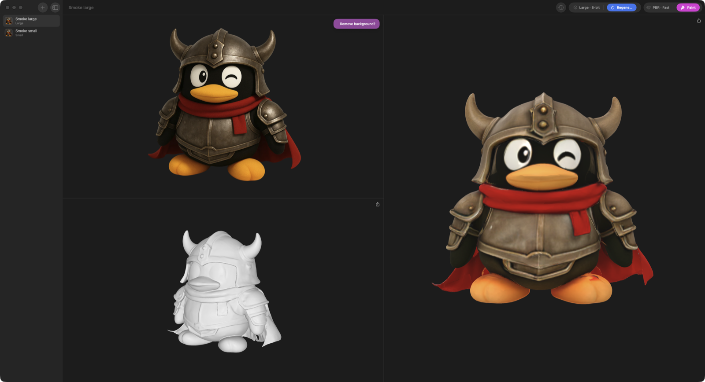
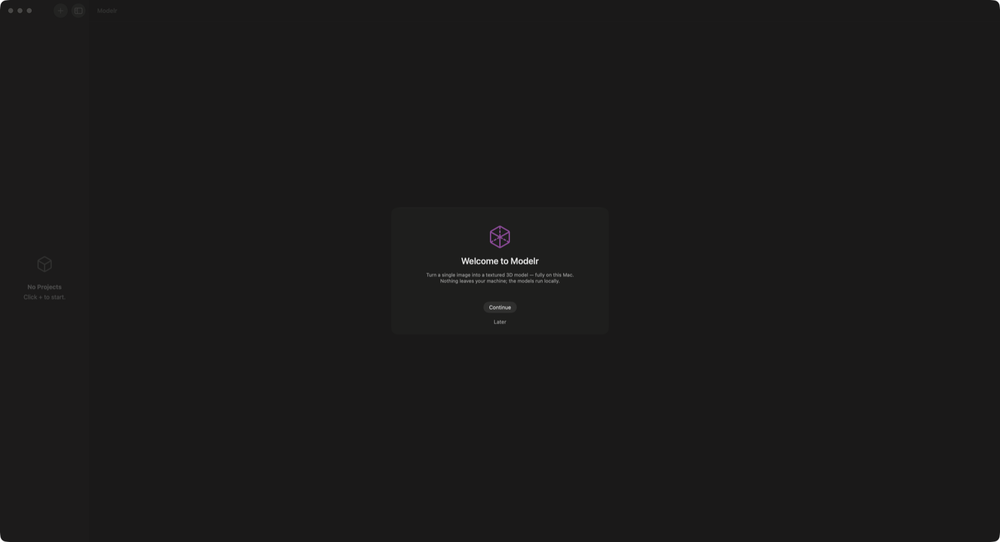
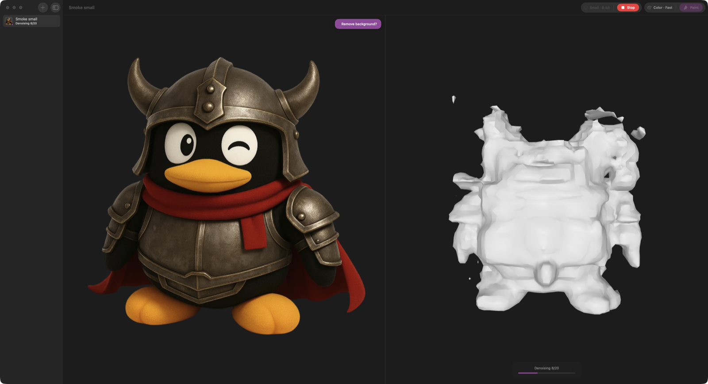

# Modelr

A native macOS app for local **image → 3D**: drop in a picture, get a shape mesh, then paint
it with a full color or PBR texture — entirely on your Mac. Both the shape and texture
pipelines run **in-process on [MLX Swift](https://github.com/ml-explore/mlx-swift)** (no
Python, no PyTorch, nothing leaves the machine) and render live in SceneKit as they generate.

<p align="center">
  
</p>

One window, project-based: each project is one input image → one shape mesh (with version
history) → optionally one painted mesh. The toolbar splits into three islands — **history**,
**shape**, and **paint** — and every completed generation is kept as an immutable version you
can restore or export.

## Requirements

- Apple silicon Mac (M1 or newer)
- macOS 14 or later
- Disk for the models you choose (~7.7 GB for the small pair, up to ~21 GB for all four)

## Models

Modelr ships four models — one small and one large per stage — downloaded on first run from
curated, public Hugging Face repos under
[`zimengxiong`](https://huggingface.co/zimengxiong). Times below are measured in-app on an
M4 Max (with mesh decimation before paint).

| Slot | Checkpoint | Notes | Time |
|---|---|---|---|
| **Shape · Small** | `hunyuan3d-dit-v2-mini` (0.6B) | fastest, low RAM | ~52 s |
| **Shape · Large** | `hunyuan3d-dit-v2-0-turbo` (1.1B) | 8-step consistency | ~57 s |
| **Paint · Small** | `hunyuan3d-paint-v2-0` | RGB color, 2048 atlas | ~94 s |
| **Paint · Large** | `hunyuan3d-paintpbr-v2-1` | PBR (albedo + metallic-roughness), 4096 atlas | ~139 s |

The four weight repos:
[`hunyuan3d-mlx-shape-small`](https://huggingface.co/zimengxiong/hunyuan3d-mlx-shape-small) ·
[`hunyuan3d-mlx-shape-large`](https://huggingface.co/zimengxiong/hunyuan3d-mlx-shape-large) ·
[`hunyuan3d-mlx-paint-small`](https://huggingface.co/zimengxiong/hunyuan3d-mlx-paint-small) ·
[`hunyuan3d-mlx-paint-large`](https://huggingface.co/zimengxiong/hunyuan3d-mlx-paint-large).
Each is self-contained, and the exact revisions + per-file sizes and sha256 hashes are pinned
in [`model_manifest.json`](model_manifest.json) (baked into `ModelCatalog.swift`).

### Onboarding & downloads

<p align="center">
  
  
</p>

First run offers three presets — **Fast start** (small pair), **Best quality** (large pair),
or **Everything** — with a live free-disk check; skipping is always allowed. Downloads are
resumable: each file is fetched to a `.partial`, verified by size + sha256, then atomically
renamed. Quitting mid-download and relaunching resumes from the byte offset (HTTP Range
against the Hugging Face CDN). Models can be added or removed any time from **Settings →
Models**.

## Architecture

Modelr is built around a single pure reducer — `reduce(state, event) -> (state', [Effect])` —
so the entire transition table (onboarding, downloads, shape, paint, cancel/fail edges,
stale-token protection) is unit-testable with no UI, network, or GPU. The full product
surface, state machines, weights contract, and verification plan live in
**[`DESIGN.md`](DESIGN.md)**; the map below is the short version.

```
MainActor
  AppState (reducer + state)          Sources/Core/AppReducer.swift, AppState.swift,
    - AppPhase (onboarding/ready)                  AppEvent.swift, AppEffect.swift
    - ModelInstallStore [4 models]
    - ProjectStore [shape/paint jobs, versions]    Sources/ProjectStore.swift
        │ effects
   ┌────┴─────────────┬───────────────────┐
   DownloadManager    EngineArbiter        (SwiftUI views = pure f(state))
   URLSession +       actor: exclusive     Sources/ContentView.swift,
   Range resume +     GPU owner, single    OnboardingView, ModelManagerView,
   sha256 verify      model residency      ProjectDetailView, MeshViewer, …
   (Core/)            (Core/)
                         │
                ┌────────┴────────┐
                ShapeEngine        PaintEngine        (serial, off-main)
                → Hy3DMLX          → HunyuanPaintMLX   (vendored in Packages/)
```

- **Reducer & state** — `Sources/Core/{AppReducer,AppState,AppEvent,AppEffect}.swift`. Every
  job carries a monotonic token; events with a stale token are dropped.
- **DownloadManager** (`Sources/Core/DownloadManager.swift`) — resumable, hash-verified
  downloads; install state is re-derived from disk at every boot.
- **EngineArbiter** (`Sources/Core/EngineArbiter.swift`) — an actor that grants the GPU to one
  job at a time; shape and paint never run concurrently, and switching stages evicts the other
  model's weights (single residency, bounded RAM).
- **Engines** — `Sources/{ShapeEngine,PaintEngine}.swift` drive the vendored `Hy3DMLX` and
  `HunyuanPaintMLX` packages in `Packages/`. Paint decimates meshes above a face budget (QEM)
  before xatlas unwrap, falling back to the original mesh if unwrap rejects it.
- **Catalog & migration** — `Sources/Core/{ModelCatalog,LegacyMigration}.swift`; mesh export
  and decimation in `Sources/Core/{MeshExporter,MeshDecimator}.swift`.

## Build

```bash
brew install xcodegen                 # if needed
xcodegen generate                     # creates Modelr.xcodeproj from project.yml
open Modelr.xcodeproj                  # then ⌘R
```

Command-line release build (Apple silicon only — the MLX/Metal and Float16 paths do not
compile for x86_64, so the build is pinned to `arm64`):

```bash
xcodegen generate
xcodebuild -project Modelr.xcodeproj -scheme Modelr -configuration Release \
    ARCHS=arm64 CODE_SIGNING_ALLOWED=NO build
```

Debug ad-hoc signs (identity `-`) so a machine without the team certificate can build; Release
is set up for the Developer ID team but builds fine unsigned with `CODE_SIGNING_ALLOWED=NO` as
above. The app is unsandboxed. No notarization is performed here.

## Tests

The deterministic core compiles directly into the test bundle (no `TEST_HOST`), so tests run
headless — no app launch, no GPU:

```bash
xcodebuild -project Modelr.xcodeproj -scheme Modelr -destination 'platform=macOS' test
```

This covers the reducer transition tables, the `DownloadManager` (against a local HTTP server
exercising kill/resume mid-file, corrupt-hash, and disk-full), the project store, and mesh
export/decimation.

### End-to-end smoke (`MODELR_UI_SMOKE`)

The app can self-drive its real flow for verification — no external UI automation. With
`MODELR_UI_SMOKE=1` it walks onboarding → create project → import image → generate → paint →
export GLB, capturing its own window at each stage, then exits 0. Environment knobs
(`MODELR_SMOKE_OUT`, `MODELR_SMOKE_MODEL`, `MODELR_SMOKE_IMAGE`, `MODELR_SMOKE_IMPORT`,
`MODELR_SMOKE_DOWNLOAD`) are documented in [`Sources/SmokeRunner.swift`](Sources/SmokeRunner.swift).
Captured runs (onboarding, generating preview, shape, paint, export) for both the small and
large lineups, plus a real download+resume trace, are under `docs/e2e/`.

## Storage layout

Everything lives under `~/Library/Application Support/Modelr/`:

```
models/
  shape-small/  shape-large/  paint-small/  paint-large/   # one folder per installed model
  *.partial                                                # in-flight, resumable downloads
projects.json                                              # index (atomic writes, backup-on-corrupt)
projects/<uuid>/                                           # source image, mask, mesh + texture versions
```

Installed models are re-derived from disk at boot (size check), so deleting a folder outside
the app can never wedge the UI.

## Credits & licenses

Modelr vendors its dependencies (user mandate: everything vendored, reproducible builds):

- **Hy3DMLX / HunyuanPaintMLX** (`Packages/`) — the shape and paint Swift libraries, shared
  with the open-source [`Hunyuan3D-Swift`](../Projects/Hunyuan3D-Swift) package.
- **[mlx-swift](https://github.com/ml-explore/mlx-swift)** (`vendor/mlx-swift`) — MIT
  (© Apple Inc.); transitively `swift-numerics` (Apache-2.0) and bundled `fmt` (MIT).
- **xatlas** (in the paint package) — MIT (© Jonathan Young).
- **Model weights** — the Hunyuan3D shape/paint checkpoints are released by Tencent under the
  **Tencent Hunyuan3D Community License**; the PBR model's DINOv2 encoder is **Apache-2.0**
  (Meta) and the RealESRGAN super-resolution weights are **BSD-3-Clause**. Weights are
  downloaded at runtime, not bundled.
